[TOC]

# 1.项目构想

## 1.维基百科介绍

​	中国铁路客户服务中心，俗称12306网站，是中国国家铁路集团有限公司下属的信息服务网站，基于中国铁道科学研究院所设计的“铁路客票发售及预订系统”创建。

## 2.中国铁路在线购票网站介绍

​	众所周知，12306是我国的主要铁路在线购票网站，一般情况下，我们购买火车票时会选择下载12306手机客户端。此外，国家也通过12306平台向在校大学生提供上学和返校时乘车的半价优惠政策。近年来，随着春运、寒暑假期和外出打工等原因，在中国的13亿人口中每天都有无数人通过12306网站购买火车票。12306网站不仅能够及时响应需求，还能保障数据的安全，这个项目毫无疑问是非常强大和可靠的。

## 3.关于12307

​	因此，我决定以12306为灵感，打造自己的铁路购票项目——12307在线售票项目!

# 2.技术选型

## 1.编程语言

​	近年来，随着互联网的蓬勃发展，各大编程语言都以令人惊叹的速度迅猛发展。在这众多编程语言中，Java毫无疑问承载着沉甸甸的期望。Java凭借其完善的生态系统和简洁的语法，赢得了广泛的喜爱，不仅在服务端表现出色，也在移动端和PC端大放异彩。作为服务端主要编程语言，它在高并发项目无疑是得到了行业内人士的高度肯定，因此，我们选择Java语言来完成12307项目。

## 2.微服务框架

​	大型互联网项目的尽头是微服务，但与编程语言不同的是，开源的微服务框架并不多，SpringCloud与Dubbo是我们为数不多的选择。Dubbo是阿里巴巴公司的一款RPC远程过程调用工具，集成与SpringCloud，但Dubbo从 3.0 开始已经不再与 Spring Cloud Alibaba 进行集成，Dubbo的日益壮大，使得它可以和SpringCloud平起平坐。SpringFramework诞生于2002年，在那个编程语言刚刚兴起的年代，Java语言的SpringFramework无疑是带给Java一个“春天”，使得Java在众多编程语言中优势更明显，多年来，Spring的发展越发势不可挡，之后更是推出了微服务解决方案——SpringCloud，而后来SpringCloud的开发依赖的更多的却是Netflix公司的库与工具，但是近些年来中国的阿里巴巴公司对SpringCloud代码贡献无疑是使得SpringCloud更方便使用，而SpringCloudAlibaba的诞生，无疑是又压Dubbo一头。我们这个项目选择SpringCloudAlibaba为我们的微服务框架，使用阿里巴巴与Pivotal提供的完美微服务解决方案作为12307项目的“骨架”。

### 1.服务发现

AlibabaNacos

### 2.注册中心

AlibabaNacos

### 3.服务通信

SpringCloudOpenFeign

### 4.服务负载均衡

SpringCloudLoadBalance

### 5.微服务网关

SpringCloudGateway

### 6.流量防卫兵

AlibabaSentinel

### 7.分布式事务解决方案

AlibabaSeate

### 8.调用链跟踪

Apache SkyWalking

## 3.数据库

​	我们选择MySQL数据库作为数据存储引擎，MySQL是一个流行的开源关系型数据库管理系统，它的低成本、高性能、可扩展性、活跃社区、完整的ACID等等优点，无疑和本项目需求非常契合。

## 4.中间件

​	中间件的选择比较繁杂，本次选择的是：缓存中间件——Redis、消息中间件——RabbitMQ。

## 5.前端框架

​	前端框架选择使用vue3，vue是目前前端比较受欢迎的框架。

## 6.其他选择

​	除了以上选择，我们还使用了Java框架：MyBatis，前端库：ElementUI，web服务器：nginx，容器技术：Docker，以及Git版本控制工具、GitHub代码托管平台。

# 3.项目后端具体实现

## 1.项目地址

https://github.com/Review7872/OnlineTicketSales.git

## 2.项目功能

​	用户：创建账户，上传头像，修改密码，实名制，接触实名，查询车票，购买车票（需实名），退购车票（需实名），改签车票（需实名），根据实名查询自己的记录（需实名），站点查询，微信支付退款

​	服务员：查询车次，为客户购票、退票、改签，查询用户的记录，火车站点查询，微信支付退款

​	乘务员：乘务员可以为乘客修改座位，并且记录车辆到站信息

​	管理员：服务员一切功能，增加车次，查询车次记录，火车到站

## 3.具体实现思路

​	对车票的订购必须通过身份证号完成，这样可以使得管理员在用户没有账号的情况下实现为用户购票的功能，只有特别权限管理员才可以添加车次。	

​	用户自己购票需要注册账号，必须绑定手机号、身份证号，用户查询订单也是查询所绑定身份证号订单。

​	用户每次下订单，我们会给用户发送短信通知，以此达到用户确认订单以及提醒用户的功能。

## 4.数据库设计

​	用户数据库：用于存储用户信息，包括用户的个人资料、身份验证信息（如用户名和密码）、联系信息等。这个数据库可以支持用户注册、登录、个人资料管理等功能。

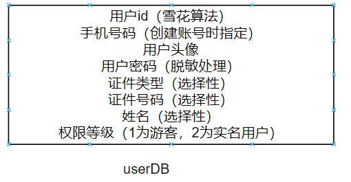

​	订单数据库：用于存储用户的订单信息，包括订票信息、车次、座位、支付状态等。这个数据库可以支持订单创建、修改、查询和支付等功能。

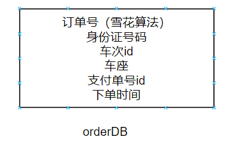

​	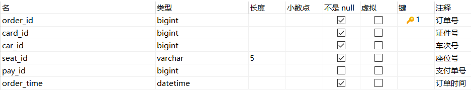

​	车次：用于存储火车车次息，包括车次时间表、站点信息、座位类型、价格等。这个数据库可以支持查询车次和票价计算等功能。

​	站点和路线数据库：用于存储火车站点和路线的信息，包括站点名称、站点位置、站点连接关系等。这个数据库可以支持查询车次路线和站点信息的功能。

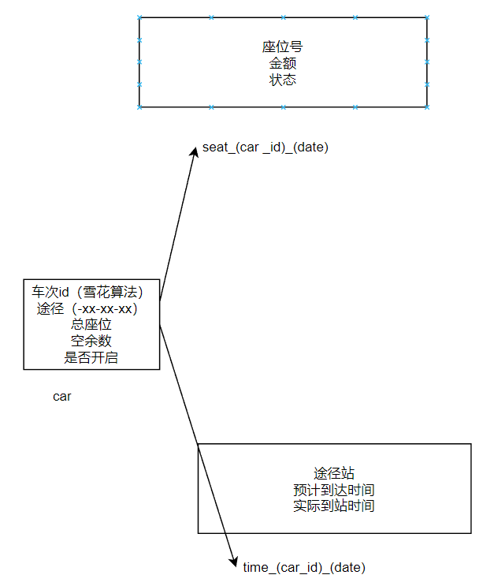

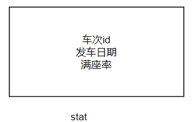  

​	支付数据库：用于处理支付交易的数据，包括支付记录、支付方式、支付状态等。这个数据库可以支持支付处理、订单支付状态更新等功能。

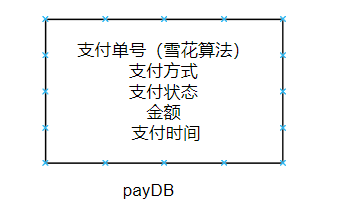

​	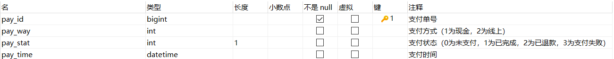

​	短信通知数据库, 我们将对用户部分自主行为进行短信通知与记录。

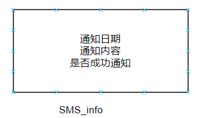

## 5.JDBC组件E-R图

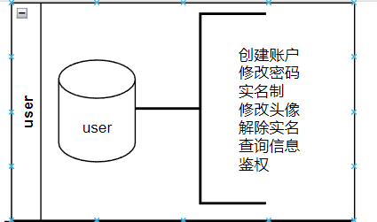

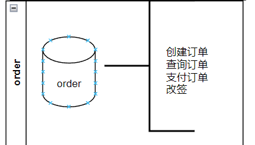

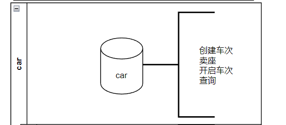

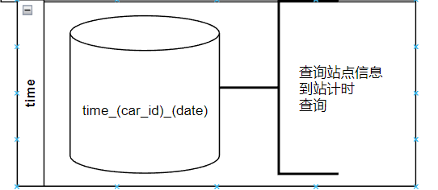

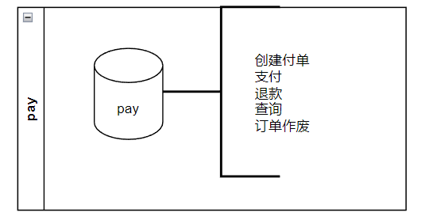

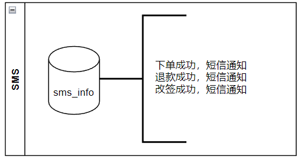

## 6.微服务组件整合E-R图

### 1.主组件

​	此组件为主组件，结合了订单组件、支付组件、车次三组件、票务统计，提供了车票的所有功能。

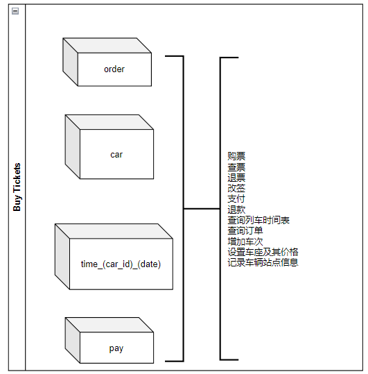

### 2.线上购票组件

​	此组件为线上购票组件，引用了主组件，以及用户组件和sms组件，对主组件某些功能进行了屏蔽，此组件为线上用户提供了一系列便捷操作，并且部分重要操作发送短信提醒。

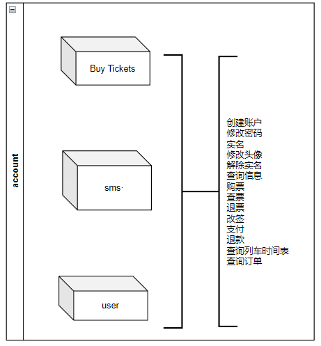

### 3.服务员组件

​	此组件为车站服务员组件，引用了主组件，对某些敏感行为进行了屏蔽，此组件可以让车站服务员对线下用户购票提供一系列服务。

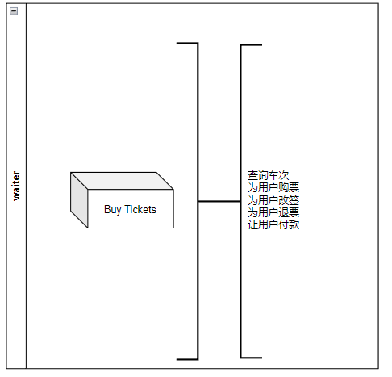

### 4.乘务员组件

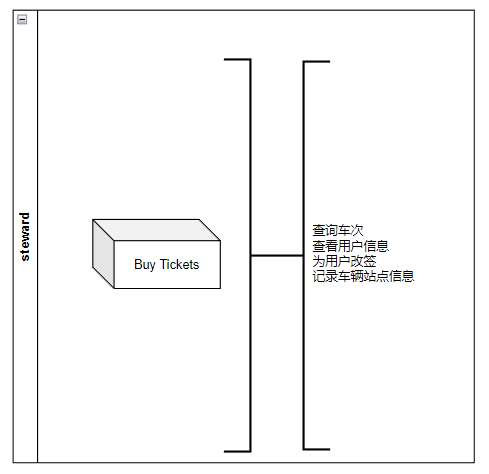

### 5.管理员组件

​	此组件为最高管理员组件，拥有添加车次与座位价格的权限。

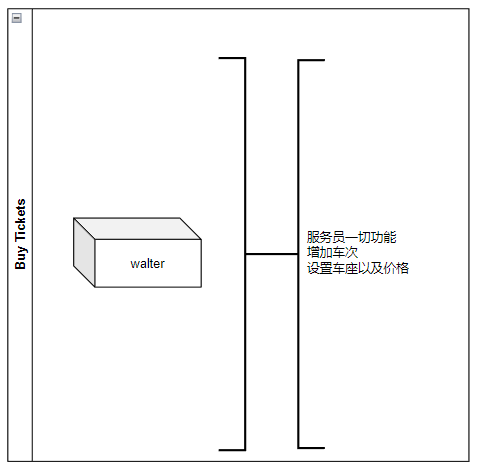

### 6.服务器网关

​	此组件作用为对访问的身份信息进行身份认证、鉴权与服务引导，同时与前端服务器Nginx结合解决前后端分离中的跨域问题。

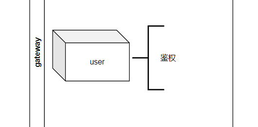

## 7.SpringCloudAlibaba整合思路

​	我们的项目分为三个层次，第一层为JDBC层，是Java与数据库的交互，第二层为主要业务层，第三层为暴露接口层。在第三层中，大多操作为引用主要业务层，只有在account组件里有引用sms组件与user组件，user组件的引用事务性不强，sms组件我们将使用消息队列解耦合。因此，我们需要在第一层与第二层之间添加分布式事务seate，以此保证我们的事务安全；在第三层添加流量防卫兵，以流量切入，从流量路由、流量控制、流 量整形、熔断降级、系统自适应过载保护、热点流量防护等多个维度来保障项目的稳定性；在第四层添加gateway进行身份认证、鉴权与服务引导。

> sentinel的规则持久化需要将此微服务放置于nacos的SENTINEL_GROUP组内，而seate需要将微服务放置于SEATA_GROUP组内，故此两个组件不能同时使用

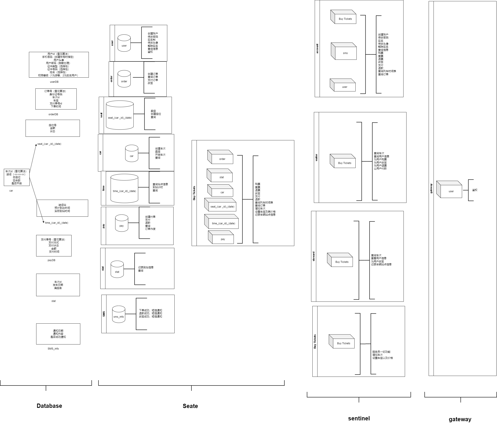

# 4.项目前端实现记录

# 5.项目部署

## 1.Docker部署

- 安装docker容器并启动docker容器

  ```shell
  sudo yum remove docker \
                    docker-client \
                    docker-client-latest \
                    docker-common \
                    docker-latest \
                    docker-latest-logrotate \
                    docker-logrotate \
                    docker-engine
  sudo yum install -y yum-utils
  sudo yum-config-manager --add-repo https://download.docker.com/linux/centos/docker-ce.repo
  sudo yum install -y docker-ce docker-ce-cli containerd.io docker-buildx-plugin docker-compose-plugin
  ```

- 添加国内镜像

  ```shell
  vim /etc/docker/daemon.json
  {
    "registry-mirrors": [
      "https://dockerproxy.com",
      "https://hub-mirror.c.163.com",
      "https://mirror.baidubce.com",
      "https://ccr.ccs.tencentyun.com",
      "https://registry.docker-cn.com",
      "http://hub-mirror.c.163.com",
      "https://docker.mirrors.ustc.edu.cn"
    ]
  }
  ```

- 启动docker

  ```shell
  systemctl start docker
  ```

  

# 6.项目改进日记

## 1.关于座位与站点

### 2023.11.8  22:28

​	众所周知，MySQL是关系型数据库，我在创建一个表之后，表的格式就随之固定，而我们的项目由于每辆列车的座位不固定，站点不固定，因此我们很难以一张MySQL数据库表来存储数据。这个问题使我昨天早上撰写项目提纲的时候苦恼了一会，最终我决定每个列车使用一个数据库表，昨天中午12点我给实验室右边同学提起了这个想法（由于他是23年蓝桥杯国一，我觉得他比较聪明），他对我这样做使得数据库表数量爆炸提出了质疑，最终探讨了很久，不了了之。就在刚刚我写到这个微服务组件的时候发现难度超乎了我的想象，且不说这种在业务里面创建数据库表的行为MyBatis框架都压根不支持，日后维护数据库也会非常麻烦......但是片刻之后，我想到了那句程序界的名言“计算机领域的任何问题都可以通过增加一个间接的中间层来解决，除非问题是中间层太多了”，我们或许不用非得用MySQL这种表格式固定的存储数据库，我们可以选择Redis，Redis支持那么多数据类型，而且实在不行我自己写一个类，序列化成字符串然后放进去......

## 2.关于支付组件与订单组件分开了

### 2023.11.8  23:54

​	我在项目构思的环节就把支付的组件和订单组件分开了，在订单的数据库字段里面给订单号留了位置，但在我写代码的时候，问题出现了，这两个组件分开了，那我订单组件该怎么获取支付组件的订单号，获取不了订单号，那不完蛋了？其实我这个问题现在解决完全为之过早，我现在看来订单组件与支付组件并不需要产生交互，他们只需要被之后的主要组件调用即可，但我昨天下午还是把这个问题解决了，起初我想到的是使用MQ消息队列，抛开MQ延迟等等一系列问题，我让订单组件增加完订单之后把雪花算法生成的订单id通过MQ发给支付组件，支付组件新增数据库后拿到同样雪花算法生成的支付id，然后通过OpenFeign再凭借了两个id调用订单组件的方法把支付单号写到订单数据库里（现在看起来，这个解决方法有些脱裤子放屁，我完全可以直接用OpenFeign去调用支付组件拿到支付id，事实上我昨天睡前也确实这么做了），如果在订单新增时出现了事务异常，大不了那个支付单号作废！这个问题似乎是好像已经解决了，但是就在刚刚我突然想到已经快被我忘记了的分布式事务模型saga......我决定回退代码，还是让这几个JDBC微组件各司其职吧，到了组件整合再考虑加一个分布式事务模型saga。
