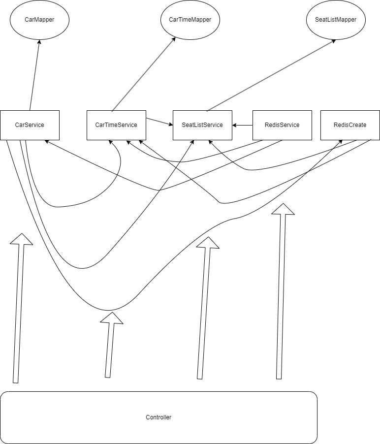

# 1.关于座位与站点

## 2023.11.8  22:28

众所周知，MySQL是关系型数据库，我在创建一个表之后，表的格式就随之固定，而我们的项目由于每辆列车的座位不固定，站点不固定，因此我们很难以一张MySQL数据库表来存储数据。这个问题使我昨天早上撰写项目提纲的时候苦恼了一会，最终我决定每个列车使用一个数据库表，昨天中午12点我给实验室右边同学提起了这个想法（由于他是23年蓝桥杯国一，我觉得他比较聪明），他对我这样做使得数据库表数量爆炸提出了质疑，最终探讨了很久，不了了之。就在刚刚我写到这个微服务组件的时候发现难度超乎了我的想象，且不说这种在业务里面创建数据库表的行为MyBatis框架都压根不支持，日后维护数据库也会非常麻烦......但是片刻之后，我想到了那句程序界的名言“计算机领域的任何问题都可以通过增加一个间接的中间层来解决，除非问题是中间层太多了”，我们或许不用非得用MySQL这种表格式固定的存储数据库，我们可以选择Redis，Redis支持那么多数据类型，而且实在不行我自己写一个类，序列化成字符串然后放进去......

## 2023.11.9 15:40

我写了两个类，一个用来记录列车每个座位的座位信息，另一个用来记录列车的站点信息。我还写了两个拓展集合类，这两个类用来继承ArrayList类然后将泛型分别指定为座位信息和站点信息。并且为了让他们序列化到Redis中更安全，我让这四个类都实现了Serializable接口，我对两个拓展增加了很多方法，之后调用这些方法便可增加座位、增加站点等等操作，在做完这些操作之后我也是考虑到了在没有完整ACID下的事务安全问题，我对这两个拓展集合类每个方法都增加了读写锁（ReadWriteLock），但是如果微服务同时从Redis中读取到了数据，那即使加了读写锁，也无法保证事务安全啊，或许我应该在业务读取Redis数据这个一步加读写锁......

## 2023.11.9 15:52

经过一会深思熟虑，我决定将读写锁加到业务层，用Redis作为数据库，其实本质上在Mapper层只有一个根据key读取value并序列化和一个序列化然后根据key写入的操作。在业务层的两种方法，一种是读取数据，这种只需要调用Mapper层的一个读取操作即可，而另一个修改数据，就需要调用Mapper层的两个操作了。虽然中间有个序列化的过程会减慢速度，但是Redis内存数据库就算加上序列化过程，我想也比MySQL硬盘数据库快很多，而且读写锁的加入，我想应该是彻底解决Redis没有完整ACID情况下数据安全问题了。

## 2023.11.9 17:29

我写到了Car的Service层，我的想法是传来一个Map集合，集合的key是站点，value是时间，然后我将集合遍历拼接（每个站点前面都要有一个"-"，这样存储在MySQL中的route就会变成"-蓬莱-烟台-郑州-西安-渭南"，如果我想从蓬莱到郑州，传来出发点"郑州"一个目的地"郑州"，响应的模糊查询便是"where route like '%'-蓬莱'%'-郑州'%' "，用'-'来分割每个城市，穿插3个'%'来找到所有能经过这个两个地方的列车），每次遍历就会拼接这辆车的所有站点（key），然后插入到数据库，同时将Map集合交给RedisService，完成在Redis中相应的数据更新。

>我想到了12306一直以来给那些跨越站点最多的人优先出售车票的行为，这应该是某种算法（一直以来我都在考虑抖音的推荐算法，以前不是很了解大数据，我猜测了很久之后觉得它应该是根据我喜欢看的视频类型给我进行分类然后给我推荐我相同类型的人喜欢的视频，说实话挺神奇的，提出大数据概念的人一定是个天才），其实一直以来我都对这些算法挺好奇的，但我又想了想可能是跨越站点较多的票可以全部出售，然后在临近发车的日期逐渐开放跨越站点少的票（例如一辆列车跨越10个站点，车票一般预售15天，在第15天到第10天这个时间段内跨越8个以上站点的票全部出售，而开放20%的票给3-7个站点，仅开放10%的票给3个站点以下，在第10天到第5天这个时间点剩余票中跨越8个以上站点的票依旧全部出售，剩余票中给3-7个站点的票从20%增加到40%，剩余票中3个站点以下开放20%，随着发车时间到来，跨越站点不同的人逐渐变得平起平坐都可以买到所有剩余的票），这样似乎可以保证跨越站点多的人可以优先买票，而剩余的座位遍出售给了跨越站点少的人。

## 2023.11.9 18:23

新问题，如果你在使用我的售票系统，那么你的用户想坐车就必须买下这一整躺旅程的这个座位，是的假如他想从郑州到西安，那就要买下从蓬莱到渭南的车票......我自定义的类中只有一个属性是存储是否被占座的，我可能要拓展这个属性，以便它可以存储每个站点的座位信息，而不是这一趟旅程，这将是项目中的一个**难点**。之前座位数据库和站点数据库是没有任何集合的，现在它们之间可能要有一些联动了。

## 2023.11.9 19:28

问题解决了，我之前将座位具体信息与座位等级、座位号、座位金额一起存储，但这样存储是没有时间维度的，我换了一种方式，我将座位具体信息绑定在了站点上，这样便有了时间的维度。具体是怎么实现的呢，就是在每个站点下再增加一个属性，这个属性是一个集合，它存储了所有的座位信息，这样就达到了每个站点都有一个集合来存储所有的座位信息。

>这里还挺复杂的，用了我很长时间，尤其是加入了座位信息后站点类各种方法的[逻辑判断 ](./car/src/main/java/com/review7872/car/pojo/CarTimeList.java)，虽然事后看起来没什么难度，但是编写逻辑时属实给我不小压力

## 2023.11.10 11:53

我在昨天[2023.11.9 15:52](#61)写到使用读写锁解决了Redis的事务问题.....我可能忘记了微服务是要做分布式架构的。既然Java的原生读写锁不能使用，那就只能调用Redisson的读写锁来实现（真正明白了分布式锁是什么东西）。

## 2023.11.10 19:58

花了一天时间完结car组件的工作，在Redis的业务上加事务的问题，最终使用了Redisson的读写锁，并且设计到seat和carTime两个库的操作时，我先是去获取两把读锁锁住数据然后拿到两个数据的副本再去进行操作，如果最终出现了结果异常就将副本插回Redis库然后抛出异常并打印错误日志，由于拿到两把锁后再去进行操作时还需要获取锁，由此可得，读写锁是可重入锁。

## 2023.11.17 12:25

我意识到car组件的事务安全性非常差。我想了想，其实只有少部分操作涉及到MySQL事务叠加Redis操作，由于没有涉及到事务嵌套，假如Redis操作已经提交，MySQL再发生异常，就会导致Redis数据异常。我对此做出的处理是：将Redis操作尽量放置于MySQL事务之后。一旦设计到Redis操作的叠加，就将叠加操作提取出来做写简单的事务代码。

> tips：最好不要让某个方法返回值为void，否则之后的业务逻辑中很难清楚的看到该方法的执行结果。

由于Car组件的逻辑过于复杂，为了防止循环依赖，我画了一个依赖图。看着再Service层有点复杂，尤其是RedisCreate的加入，但RedisCreate作用完全与RedisService类似，都是对Redis操作添加事务，将它分离出来是为了避免RedisService与CarService的循环依赖。现在只有一直情况能使得事务失败，那就是Redis执行完成之后，注解式事务提交之前，由于服务器停电、内存不足等等一些不可抗力问题导致服务中断。另外，在本项目中，由于我第一次使用轻量锁Lock，并且在Redis事务中获取到了两个RedisService的写锁，可能是一种滥用锁的行为，但是Redis事务基本是新建列车，修改列车站点等等一些几乎没有并发的操作，所以应该没有问题。

# 2.关于支付组件与订单组件分开了

## 2023.11.8  23:54

我在项目构思的环节就把支付的组件和订单组件分开了，在订单的数据库字段里面给订单号留了位置，但在我写代码的时候，问题出现了，这两个组件分开了，那我订单组件该怎么获取支付组件的订单号，获取不了订单号，那不完蛋了？其实我这个问题现在解决完全为之过早，我现在看来订单组件与支付组件并不需要产生交互，他们只需要被之后的主要组件调用即可，但我昨天下午还是把这个问题解决了，起初我想到的是使用MQ消息队列，抛开MQ延迟等等一系列问题，我让订单组件增加完订单之后把雪花算法生成的订单id通过MQ发给支付组件，支付组件新增数据库后拿到同样雪花算法生成的支付id，然后通过OpenFeign再凭借了两个id调用订单组件的方法把支付单号写到订单数据库里（现在看起来，这个解决方法有些脱裤子放屁，我完全可以直接用OpenFeign去调用支付组件拿到支付id，事实上我昨天睡前也确实这么做了），如果在订单新增时出现了事务异常，大不了那个支付单号作废！这个问题似乎是好像已经解决了，但是就在刚刚我突然想到已经快被我忘记了的分布式事务模型saga......我决定回退代码，还是让这几个JDBC微组件各司其职吧，到了组件整合再考虑加一个分布式事务模型saga。

# 3.
